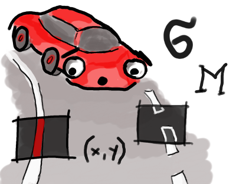
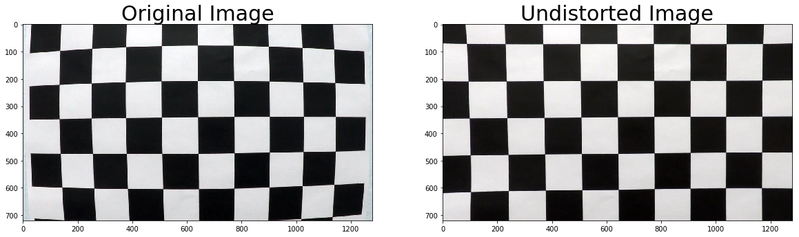
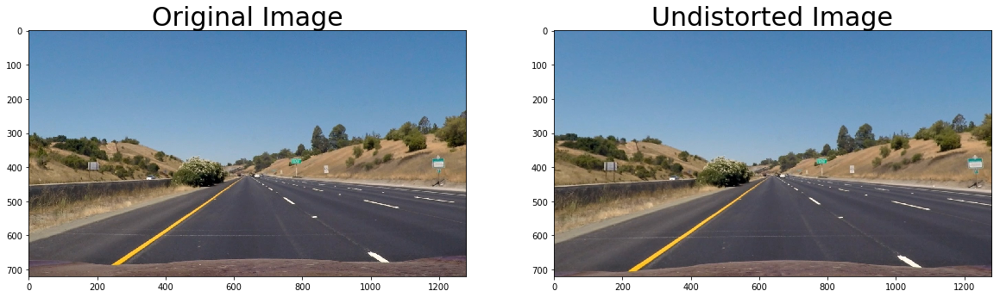
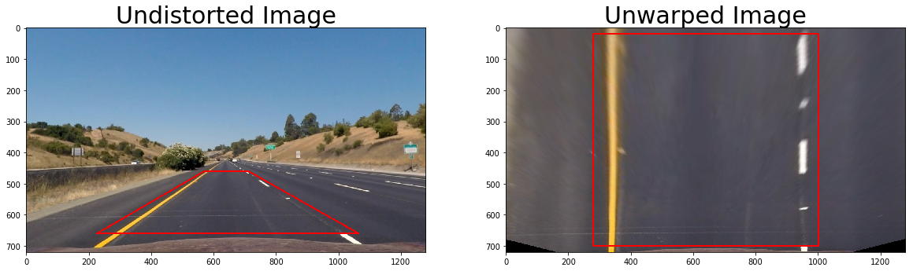
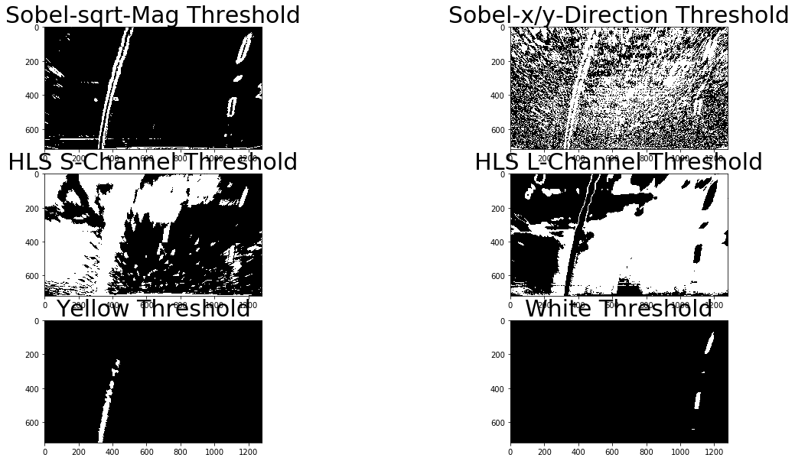
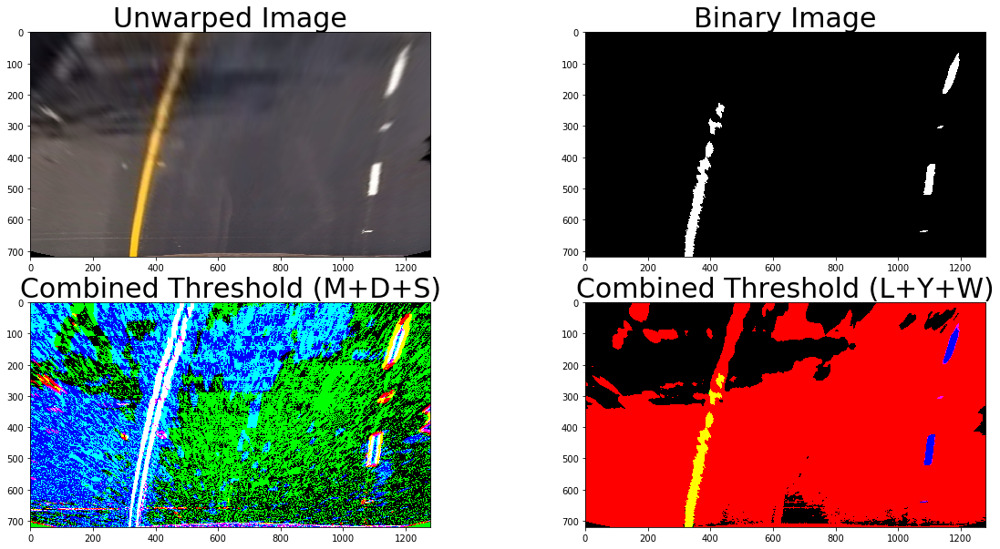
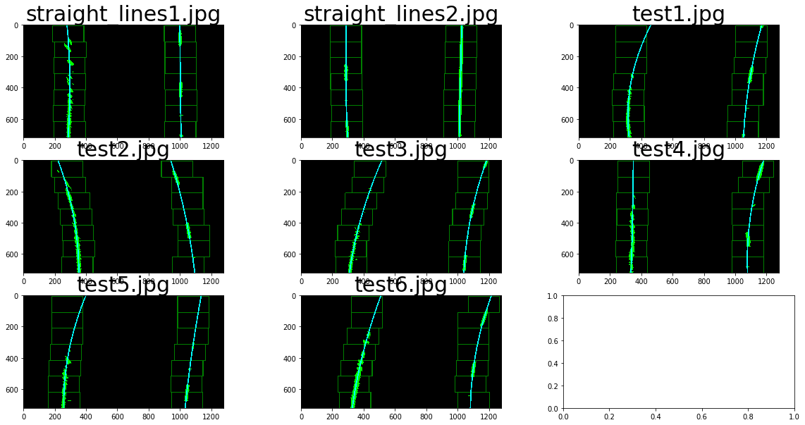
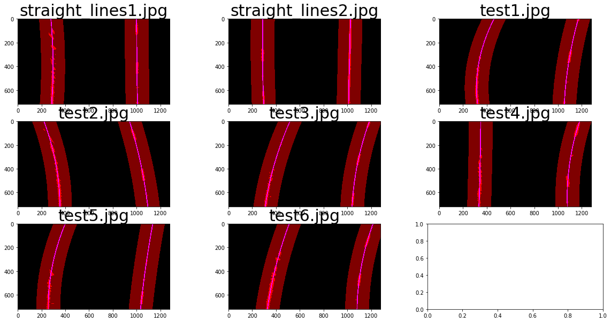
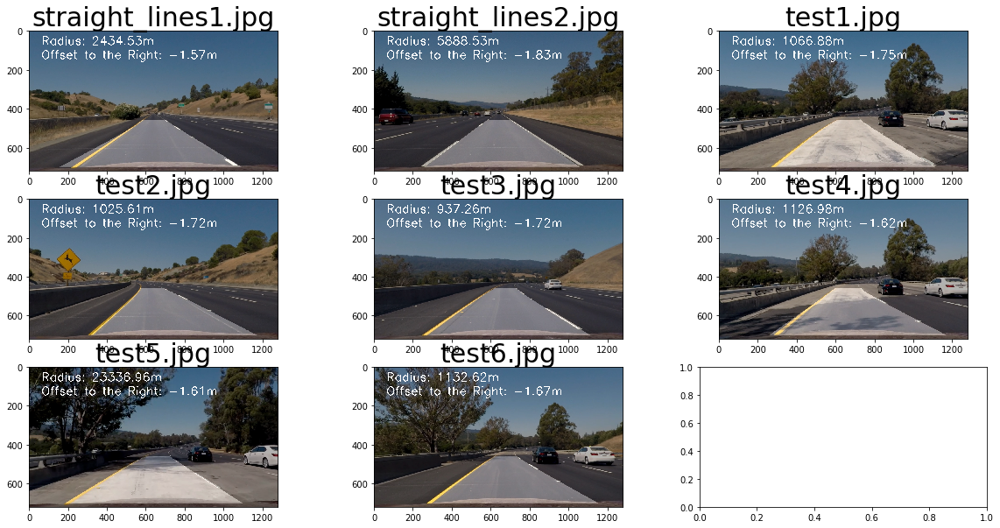

# Self Driving Car Engineer Project 4 - Advanced Lane Line Detection
## Benjamin Söllner, 21 Jun 2017

---



---

The goals / steps of this project are the following:

* Compute the camera calibration matrix and distortion coefficients given a set of chessboard images.
* Apply a distortion correction to raw images.
* Use color transforms, gradients, etc., to create a thresholded binary image.
* Apply a perspective transform to rectify binary image ("birds-eye view").
* Detect lane pixels and fit to find the lane boundary.
* Determine the curvature of the lane and vehicle position with respect to center.
* Warp the detected lane boundaries back onto the original image.
* Output visual display of the lane boundaries and numerical estimation of lane curvature and vehicle position.

## Rubric Points
Here I will consider the [rubric points](https://review.udacity.com/#!/rubrics/571/view) individually and describe how I addressed each point in my implementation. Code references are made to CELLs of the [Python Notebook](CarND 04 Advanced Lane Line Detection.ipynb) ([HTML Version](CarND 04 Advanced Lane Line Detection.html)).

### Task #1: Compute the camera matrix and distortion coefficients. Provide an example of a distortion corrected calibration image.

The camera matrix has been implemented in CELL 2. Chessboard corners have been found for all calibration images in line 26 ...
```python
returncode, corners = cv2.findChessboardCorners(gray, (cal_rows,cal_cols), None)
```
... appended to the object points array after which an undistortion is performed in CELL 3 with said points (line 8f.) ...
```python
cal_ret, cal_matrix, cal_dist, cal_rvecs, cal_tvecs = \
    cv2.calibrateCamera(cal_objpoints, cal_imgpoints, cal_test_image_size, None, None)
```

The calibration parameters (```cal_*``` variables) are saved & restored via a pickle file which is used to undistort the images. A ```undistort(...)``` function is implemented in CELL 4 which calls ```cv2.undistort(...)``` with the correct paramaters (line 12):
```python
return cv2.undistort(image, CAL_PICKLE["matrix"], CAL_PICKLE["dist"], None, CAL_PICKLE["matrix"])
```

Here is an example of this function applied to a checkerboard image:



### Task #2: Provide an example of a distortion-corrected image.

The ```undistort(...)```-function can be equally applied to the test images. Here is an example of that (see also CELL 5):



### Task #3: Perform a perspective transform and provide an example of a transformed image.

Perspective transformation is done by identifying a trapezoid on the lower area of a straight-lane image and warping this image into a flat area, carefully trying to straighten out the lane lines.

This is done in CELL 6. The trapezoid is defined in a global variable ```UNWARP_PLANE``` (CELL 1), the vertical and horizontal margin is configured via ```UNWARP_X_OFFSET``` and ```UNWARP_Y_OFFSET``` (CELL 1).  

The ```unwarp(...)``` function in CELL 6 can be applied to any image and unwarps it using these globally defined variables (see lines 22-24):

```python
transform_matrix = cv2.getPerspectiveTransform(np.float32(source), np.float32(dest))
inverse_matrix = cv2.getPerspectiveTransform(np.float32(dest), np.float32(source))
unwarped = cv2.warpPerspective(undistorted, transform_matrix, dim, flags=cv2.INTER_LINEAR)
```

Here is an example of the undistorted and unwarped image:



### Task #4: Use color transforms, gradients or other methods to create a thresholded binary image. Provide an example of a binary image result.

Several functions, that create threshold images have been created. CELL 7 defines ```*_threshold(...)``` functions that can be applied to an image and return different possible thresholds that could be logically combined:

* ```mag_threshold(...)``` creates a Sobel-Magnitude threshold for every pixel with a kernel of (default) 5 and a threshold between 10 and 130 (as tuned by the global variable ```THRESH_MAG```)
* ```dir_threshold(...)``` creates a Sobel-Directional threshold for every pixel with a kernel of (default) 5 and a threshold lower than 0.7 or higher than 1.5 (as tuned by the global variable ```THRESH_DIR```)
* ```s_threshold(...)``` creates a S-of-HLS-channel threshold with a threshold between 15 and 255 (as tuned by the global variable ```THRESH_S```)
* ```l_threshold(...)``` creates a S-of-HLS-channel threshold with a threshold between a defined upper and lower bound, e.g., 70 and 90
* ```yellow_threshold(...)``` aims to catch the yellow line images by applying thresholding in all three channels of the HSV space (CELL 7, lines 76-84)
* ```white_threshold(...)``` applies a mixture of thresholdings in the HSV, HLS and RGB space to catch white pixels and marks a union of all pixels found (CELL 7, lines 88-103)

Below, you can see the filters in action for test image ```test6.jpg```:



A simple union of the ```yellow_threshold(...)``` and the ```white_threshold(...)``` pixels was sufficient to do the job, see the "Binary Image" below. All other thresholdings added too much noise. Also see below, in the second row, a mapping of the 6 thresholdings to two RGB images, in order to asess how certain thresholdings compliment each other:



### Task #5: Identify lane-line pixels and fit their positions with a polynomial?

Lane line pixel finding was done with a combination of *slidewindow search* and *proximity search* as described [in the course](https://classroom.udacity.com/nanodegrees/nd013/parts/fbf77062-5703-404e-b60c-95b78b2f3f9e/modules/2b62a1c3-e151-4a0e-b6b6-e424fa46ceab/lessons/40ec78ee-fb7c-4b53-94a8-028c5c60b858/concepts/c41a4b6b-9e57-44e6-9df9-7e4e74a1a49a).

#### Slidewindow Search

In order to find the lower bounds where to start the slidewindow search, the aggregated brightness across the y-dimension has been taken across the lower half of the image (CELL 9, function ```whiteness_half_across_y(...)```) and then global maxima have been searched left and right of the center of the sequence (CELL 9, function ```find_peaks(...)```). Here is an image of this sequence, including the peaks (in red):




#### Proximity Search



#### Combining both strategies

### Task #6: Calculate the radius of curvature of the lane and the position of the vehicle with respect to center.

### Task #7: Plot result back down onto the road such that the lane area is identified clearly.



### Task #8: Provide a link to your final video output. Your pipeline should perform reasonably well on the entire project video (wobbly lines are ok but no catastrophic failures that would cause the car to drive off the road!)

Here's a [link to my video result](./project_video_output.mp4).

## Files Submitted & Code Quality

My project includes the following files:
....
