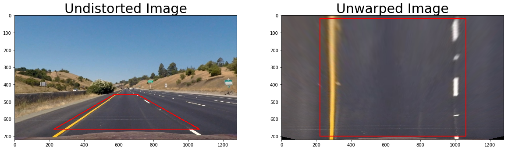
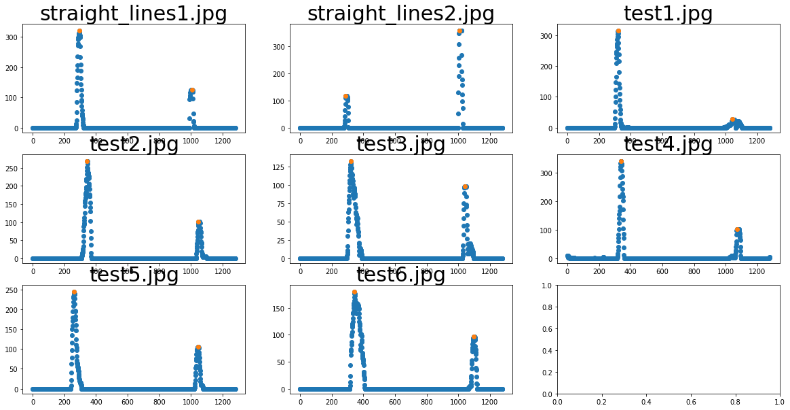
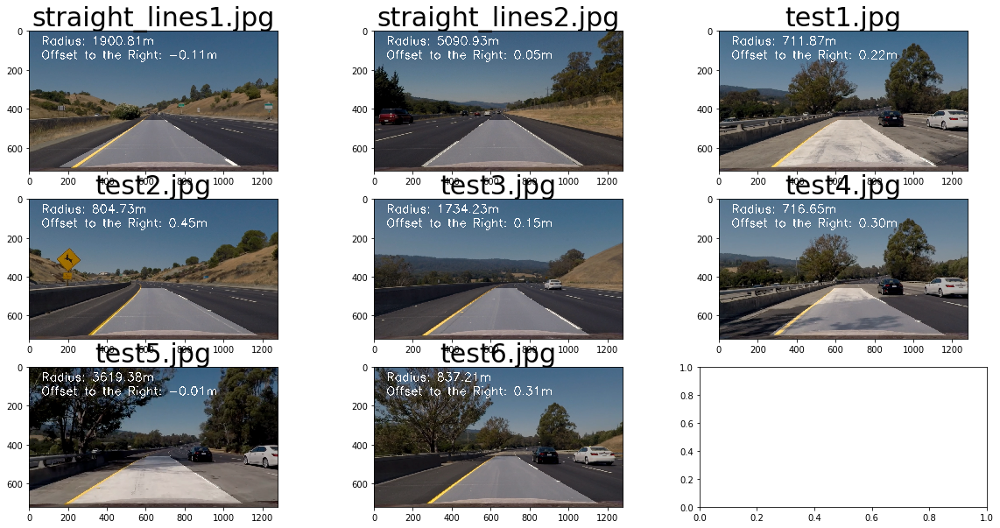

# Self Driving Car Engineer Project 4 - Advanced Lane Line Detection
## Benjamin Söllner, 22 Jun 2017

---


---

The goals / steps of this project are the following:

* Compute the camera calibration matrix and distortion coefficients given a set of chessboard images.
* Apply a distortion correction to raw images.
* Use color transforms, gradients, etc., to create a thresholded binary image.
* Apply a perspective transform to rectify binary image ("birds-eye view").
* Detect lane pixels and fit to find the lane boundary.
* Determine the curvature of the lane and vehicle position with respect to center.
* Warp the detected lane boundaries back onto the original image.
* Output visual display of the lane boundaries and numerical estimation of lane curvature and vehicle position.

## Rubric Points

Here I will consider the [rubric points](https://review.udacity.com/#!/rubrics/571/view) individually and describe how I addressed each point in my implementation. Code references are made to CELLs of the [Python Notebook](CarND 04 Advanced Lane Line Detection.ipynb) ([HTML Version](CarND 04 Advanced Lane Line Detection.html)). In the python notebook, you can also see the *Task #...*s from the rubric referenced that we will reference here.

### Task #1: Compute the camera matrix and distortion coefficients. Provide an example of a distortion corrected calibration image.

The camera matrix has been implemented in CELL 2. Chessboard corners have been found for all calibration images in line 26 ...
```python
returncode, corners = cv2.findChessboardCorners(gray, (cal_rows,cal_cols), None)
```
... appended to the object points array after which an undistortion is performed in CELL 3 with said points (line 8f.) ...
```python
cal_ret, cal_matrix, cal_dist, cal_rvecs, cal_tvecs = \
    cv2.calibrateCamera(cal_objpoints, cal_imgpoints, cal_test_image_size, None, None)
```

The calibration parameters (```cal_*``` variables) are saved & restored via a pickle file which is used to undistort the images. A ```undistort(...)``` function is implemented in CELL 4 which calls ```cv2.undistort(...)``` with the correct paramaters (line 12):
```python
return cv2.undistort(image, CAL_PICKLE["matrix"], CAL_PICKLE["dist"], None, CAL_PICKLE["matrix"])
```

Here is an example of this function applied to a checkerboard image:


### Task #2: Provide an example of a distortion-corrected image.

The ```undistort(...)```-function can be equally applied to the test images. Here is an example of that (see also CELL 5):


### Task #3: Perform a perspective transform and provide an example of a transformed image.

Perspective transformation is done by identifying a trapezoid on the lower area of a straight-lane image and warping this image into a flat area, carefully trying to straighten out the lane lines.

This is done in CELL 6. The trapezoid is defined in a global variable ```UNWARP_PLANE``` (CELL 1), the vertical and horizontal margin is configured via ```UNWARP_X_OFFSET``` and ```UNWARP_Y_OFFSET``` (CELL 1).  

The ```unwarp(...)``` function in CELL 6 can be applied to any image and unwarps it using these globally defined variables (see lines 22-24):

```python
transform_matrix = cv2.getPerspectiveTransform(np.float32(source), np.float32(dest))
inverse_matrix = cv2.getPerspectiveTransform(np.float32(dest), np.float32(source))
unwarped = cv2.warpPerspective(undistorted, transform_matrix, dim, flags=cv2.INTER_LINEAR)
```

Here is an example of the undistorted and unwarped image:



### Task #4: Use color transforms, gradients or other methods to create a thresholded binary image. Provide an example of a binary image result.

Several functions, that create threshold images have been created. CELL 7 defines ```*_threshold(...)``` functions that can be applied to an image and return different possible thresholds that could be logically combined:

* ```mag_threshold(...)``` creates a Sobel-Magnitude threshold for every pixel with a kernel of (default) 5 and a threshold between 10 and 130 (as tuned by the global variable ```THRESH_MAG```)
* ```dir_threshold(...)``` creates a Sobel-Directional threshold for every pixel with a kernel of (default) 5 and a threshold lower than 0.7 or higher than 1.5 (as tuned by the global variable ```THRESH_DIR```)
* ```s_threshold(...)``` creates a S-of-HLS-channel threshold with a threshold between 15 and 255 (as tuned by the global variable ```THRESH_S```)
* ```l_threshold(...)``` creates a S-of-HLS-channel threshold with a threshold between a defined upper and lower bound, e.g., 70 and 90
* ```yellow_threshold(...)``` aims to catch the yellow line images by applying thresholding in all three channels of the HSV space (CELL 7, lines 76-84)
* ```white_threshold(...)``` applies a mixture of thresholdings in the HSV, HLS and RGB space to catch white pixels and marks a union of all pixels found (CELL 7, lines 88-103)

Below, you can see the filters in action for test image ```test6.jpg```:


A simple union of the ```yellow_threshold(...)``` and the ```white_threshold(...)``` pixels was sufficient to do the job, see the "Binary Image" below. All other thresholdings added too much noise. Also see below, in the second row, a mapping of the 6 thresholdings to two RGB images, in order to asess how certain thresholdings compliment each other:


### Task #5: Identify lane-line pixels and fit their positions with a polynomial?

Lane line pixel finding was done with a combination of *slidewindow search* and *proximity search* as described [in the course](https://classroom.udacity.com/nanodegrees/nd013/parts/fbf77062-5703-404e-b60c-95b78b2f3f9e/modules/2b62a1c3-e151-4a0e-b6b6-e424fa46ceab/lessons/40ec78ee-fb7c-4b53-94a8-028c5c60b858/concepts/c41a4b6b-9e57-44e6-9df9-7e4e74a1a49a).

#### Slidewindow Search

In order to find the lower bounds where to start the slidewindow search, the aggregated brightness across the y-dimension has been taken across the lower half of the image (CELL 9, function ```whiteness_half_across_y(...)```) and then global maxima have been searched left and right of the center of the sequence (CELL 9, function ```find_peaks(...)```). Here is an image of this sequence, including the peaks (in red):



The vertical space of the image is divided into 9 sliding windows which follow the lane line progression from bottom of the image to the top. The lane line pixels are collected from the binary image retrieved by ```find_lane_line_pixels(...)``` across the sliding windows (see CELL 12, line 41 and 57)

```python
w_left_idxs = ((nonzeroy >= w_y_lo) & (nonzeroy < w_y_hi) & (nonzerox >= w_xleft_lo) & (nonzerox < w_xleft_hi)).nonzero()[0]
```
```python
w_right_idxs = ((nonzeroy >= w_y_lo) & (nonzeroy < w_y_hi) & (nonzerox >= w_xright_lo) & (nonzerox < w_xright_hi)).nonzero()[0]
```
In addition to the algorithm developed in the course, there is a "giveup" counter for the sliding windows: in case that a certain number of sliding windows does not find lane lines when moving up the image the search is preliminarily terminated. This was added in order to avoid falsely classifying especially the noisy area at the top of the images as lane line images, e.g. for the left lane line (CELL 12 lines 28ff.):

```python
giveup_left = 0
# [...]
for w in range(nwindows):
    # [... iterate through sliding windows ...]
    if giveup_left < giveupafter:
        # [... find lane line pixels on the left ...]
        if len(w_left_idxs) > minpix:
            # [... update sliding window center ...]
        else:
            # or update counter of unsuccessful sliding windows
            giveup_left += 1
```

After the slidewindow search a second-order polynomial is fit through the points that had been found (CELL 12, lines 85ff., for the ```LaneLine.sample_poly(...)``` function, see CELL 10, lines 19f.):

```python
left_fit_xs = left_line.sample_poly(fit_ys)
right_fit_xs = right_line.sample_poly(fit_ys)
```
```python
# Sample the fitted polygon across a number of y points
def sample_poly(self, ys, yoffset=0):
    return self.fit[0]*ys**2 + self.fit[1]*ys + self.fit[2] + yoffset
```

Here is a sample output of the slidewindow output:


#### Proximity Search

In addition to the slidewindow search, once lanes have been found, subsequent lanes are searched for with a proximity search in the area of the old lane lines. The code for this can be found in CELL 13, e.g. lines 12ff.:

```python
left_idxs = ((nonzerox > old_lane.left.sample_poly(nonzeroy, yoffset=-pmargin)) & \
            (nonzerox < old_lane.left.sample_poly(nonzeroy, yoffset=+pmargin)))
right_idxs = ((nonzerox > old_lane.right.sample_poly(nonzeroy, yoffset=-pmargin)) & \
             (nonzerox < old_lane.right.sample_poly(nonzeroy, yoffset=+pmargin)))
```

In the following image, you can see how the proximity search works (for this example for the sake of simplicity, we are just retrieving the lane lines on the very same image and then doing the proximity search on the same image):


#### Combining Both strategies

Both strategies (```slidewindow_search(...)``` and ```proximity_search(...)```) are combined (```combined_search(...)```, CELL 14). The following strategies are used to trade off both strategies and sanity-check both of them:

* If either of the two methods do not find a lane (because the left or right lane does not contain lane line pixels), the other strategy is used.
* If no previous image & lane was provided, the slidewindow search will be used.
* If a previous image & lane was provided, this lane is averaged with the newly found lane (CELL 14 line 19+24, the "+" and "/" operator is overloaded in the "Lane" and "LaneLine" class, see CELL 10 and 11):

  ```python
slidewindow_lane_avg = (old_lane + slidewindow_lane)/2
```
  ```python
proximity_lane_avg = (old_lane + proximity_lane)/2
```

* If both searches return results, the lane with the lowest "insanity" is used. As metric for "insanity" the standard deviation of the lane line width across the image is used (see CELL 14 line 26ff. and CELL 11 lines 15ff.):

  ```python
if (proximity_insanity < slidewindow_insanity):
    next_lane = proximity_lane_avg
else:
    next_lane = slidewindow_lane_avg
```
  ```python
# "Insanity" of a lane is high in case the lane width varies a lot
def insanity(self, ys):
    ds = []
    # iterate across y-values and collect all lane widths
    for y in ys:
        l = self.left.fit[0]*ys**2 + self.left.fit[1]*ys + self.left.fit[2]
        r = self.right.fit[0]*ys**2 + self.right.fit[1]*ys + self.right.fit[2]
        ds.append(r-l)
    # get standard deviation of lane widths
    return np.std(ds)
```     

* If both proximity search and slidewindow search return no lane, the previous line is kept.

### Task #6: Calculate the radius of curvature of the lane and the position of the vehicle with respect to center.

In the code's ```Lane``` class, there are two functions to calculate the lane radius and current offset-from-center (CELL 11, 9ff. and 27ff.):

```python
# Curvature of a lane is defined as average curvature of the left + right lane line
def curvature(self, y):
    l = self.left.curvature(y)
    r = self.right.curvature(y)
    return (l+r)/2
```
```python
# Calculate offset from center by looking at x_vehicle_center in respect to left and right lane position
def offset_from_center(self, y, x_vehicle_center):
    global LANE_X_M_PER_PIX
    x_l = self.left.sample_poly(y)
    x_r = self.right.sample_poly(y)
    x_lane_center = (x_r-x_l)/2
    return (x_lane_center-x_vehicle_center)*LANE_X_M_PER_PIX
```

The ```curvature(...)``` function of the ```Lane``` class relies on the ```curvature(...)``` function (CELL 10, lines 22ff.):

```python
# Calculate the curvature of the polygon
def curvature(self, y):
    global LANE_Y_M_PER_PIX
    global LANE_X_M_PER_PIX
    # re-fit the polygon in world-space
    fit = np.polyfit(self.ys*LANE_Y_M_PER_PIX, self.xs*LANE_X_M_PER_PIX, 2)
    return ((1 + (2*fit[0]*y*LANE_Y_M_PER_PIX + fit[1])**2)**1.5) / np.absolute(2*fit[0])
```

### Task #7: Plot result back down onto the road such that the lane area is identified clearly.

CELL 15 plots the lane as a polygon (```update_lane(...)```, line 13f.):

```python
pts = np.hstack((right_pts, left_pts))
cv2.fillPoly(image, np.int_(pts), laneColor)
```

It also includes a stepping function that takes in a previous lane and an image and generates an output lane image and a new lane object (line 17ff.):

```python
# Stepping function: for a given new_image & old_lane, calculate a new_lane and a lane line image (lane_img)
def update_lane(old_lane, new_image, laneColor=(1., 1., 1.)):
    new_lane, out_img = combined_search(old_lane, new_image)
    lane_img = np.float_(np.zeros_like(new_image))
    plot_lane(lane_img, new_lane, laneColor)
    return new_lane, lane_img
```

The image is used in the ```update_warp(...)``` function in CELL 16, where it's warped back onto the image and layed over with the respective metrics (line 26ff.):

```python
# Stepping function: for a given new_image & old_lane, calculate a new_lane and an output image
# displaying the lane metrics and lane polygon
def update_warp(old_lane, new_image):
    global UNWARP_INV_MATRIX
    dim = (new_image.shape[1], new_image.shape[0])
    # undistort image
    out_image = undistort(new_image)
    # calculate lane and lane-image
    lane, lane_image = update_lane(old_lane, new_image, laneColor=(1., 1., 1.))
    # warp lane-image back onto original image
    warp_lane_image = cv2.warpPerspective(lane_image, UNWARP_INV_MATRIX, dim, flags=cv2.INTER_LINEAR)
    out_image = cv2.addWeighted(out_image/255., 0.7, warp_lane_image, 0.3, 0)
    # write metrics onto image
    plot_metrics(out_image, lane, textColor=(1., 1., 1.))
    return lane, out_image
```

Here are all test images with warped lanes and added metrics:



### Task #8: Provide a link to your final video output. Your pipeline should perform reasonably well on the entire project video (wobbly lines are ok but no catastrophic failures that would cause the car to drive off the road!)

CELL 17 provides a function ```process_frame(...)``` which stores the current lane line in a global variable ```process_lane_buffer``` and updates it with every step (line 14f.):

```python
process_lane_buffer, image = update_warp(process_lane_buffer, image)
```

This is done since the ```VideoClipFile.fl_image(...)``` function only takes framewise processing functions that take and return exactly one argument, the (to-be-) transformed image (line 22):

```python
video_out_clip = video_in_clip.fl_image(process_frame)
```

CELL 18 processes the whole video. Here's a [link to my video result](./project_video_output.mp4).

<video width="960" height="540" controls><source src="./project_video_output.mp4"></video>

## Task #9: Briefly discuss any problems / issues you faced in your implementation of this project. Where will your pipeline likely fail? What could you do to make it more robust?

The main challenge was finding the right threshold (with lots of trials-and-errors over test images and the video).

Here are a few thoughts how this project could still be improved:

* Smoothing could be implemented over a larger number of lanes. This would need adaption of the data structure
* Certain lane fits could be discarded as "totally insane" (like if curvature or lane width variation is too unrealistic)
* Sobel or L/S threshold could be re-considered, if a low-pass filtering would be applied that removes noise from the related binary images
* Some other form of outlier rejection of the binary image could be introduced.
* Lane base detection could be implemented with local maxima
* Heuristics could be implemented to detect when a driver is changing lanes over time, therefore shifting the middle of the lane to the side the driver is steering towards

## Files Submitted

My project includes the following files:

* [```CarND 04 Advanced Lane Line Detection.ipynb```](CarND%2004%20Advanced%20Lane%20Line%20Detection.ipynb) / [```.html```](CarND%2004%20Advanced%20Lane%20Line%20Detection.html): the (rendered) iPython notebook with the algorithm
* [```writeup_report.md```](writeup_report.md) / [```.html```](writeup_report.html): the writeup of this project including the showcase images (you are reading it)
* [```project_video_output.mp4```](project_video_output.mp4): the output video with lane line markings and lane metrics
